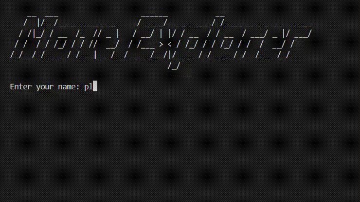

[](https://github.com/brahimab8/maze-explorer/actions)
[](https://codecov.io/gh/brahimab8/maze-explorer)
[](https://github.com/codespaces/new?repo=brahimab8/maze-explorer)

# Maze Explorer

Maze Explorer is a **terminal-based C application** that challenges you to navigate procedurally generated mazes, collect bonus projectiles, and fight/avoid roaming monsters across multiple levels of increasing difficulty.

## Features

- **Procedural Maze Generation**  
  A recursive-backtracking carver that generates a new, unique maze layout on each round.

- **Configurable Game Parameters**  
  Adjust maze size, initial ammo, symbols, frame rate and more via a persistent config file or directly through the in-game settings menu.

- **Multi-Level Progression**  
  Clear each maze and advance to harder levels with more monsters.

- **Save & Load**  
  Auto-save between levels to preserve progress.

- **Real-Time Gameplay**  
  Shoot projectiles, pick up bonus items, and track elapsed game time.

- **Unit Tested & Coverage**  
  Comprehensive CMocka tests with lcov integration.
## Tech Stack

- **Language**: ISO C11  
- **Build**: GNU Make, GCC/Clang  
- **Testing**: CMocka  
- **Coverage**: lcov   
- **Configuration**: Plain-text key/value file + in-game menu  
- **Persistence**: Binary save files  

## Getting Started

### Prerequisites

- Linux or macOS  
- `gcc` or `clang`  
- `make`  
- `lcov` (for coverage)

### Installation

```bash
git clone https://github.com/brahimab8/maze-explorer.git
cd maze-explorer
make
````

### Running

```bash
./maze_explorer
```

### Configuration

Edit `persistent.cfg` (created on first run) or use the **Settings** option from the in-game menu:

```ini
# Maze Explorer Configuration
Width=20
Height=10
InitialShots=3
FPS=30
PlayerSymbol=@
ExitSymbol=X
ProjectileSymbol=*
MonsterSymbol=M
ItemSymbol=.
ItemBonus=2
```

## Testing & Coverage

* **Run all tests**

  ```bash
  make test
  ```

* **Generate coverage report**

  ```bash
  make coverage
  ```

  Open `coverage-report/index.html` in browser.

## Demo



## License

This project is released under the [MIT License](LICENSE).
